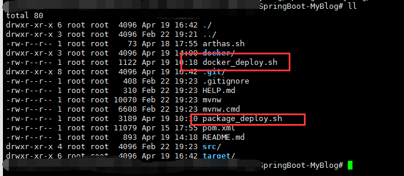
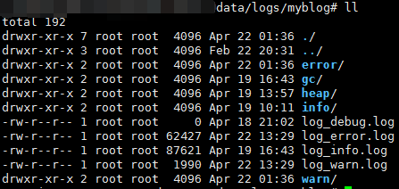

## 前言

### 为什么要搭建这个博客？

其实我很早就想搭建一个属于我自己的网站，最早是什么时候呢？应该是我读中专的时候，当时第一次用 DW 学网页设计的时候，可能就在我的心中种下了这颗种子。但是中专是不教编程的（我的专业是局域网管理），于是我去考大专，熬过一周三考试的升学之旅，终于也如愿以偿的报上了软件技术这门专业。可能是习惯于老师教导，到了大二上学期还在跟着老师学 JSP，直到大二下学期突然醒悟过来，按部就班的学是没有钱途的，于是大二下学期开始学 SSM 框架以及 SpringBoot，同时提前进入大三才开始进的项目班去学习项目开发，在项目班开发了快一年，直到今年1月才退出项目班，便开始着手搭建博客网站来整合我所学过的知识。

##  项目环境

| 工具       | 名称                             |
| ---------- | -------------------------------- |
| 开发工具   | IDEA                             |
| 开发语言   | JDK 1.8                          |
| 数据库     | MySQL 5.7                        |
| 前端框架   | Bootstarp                        |
| 项目框架   | SpringBoot + MyBatis + Thymeleaf |
| 权限框架   | SpringSecurity                   |
| 分页插件   | PageHelper                       |
| 缓存       | Redis                            |
| 构建工具   | Maven                            |
| 运行环境   | Linux / Docker                   |
| 文章编辑器 | Editor.md                        |
| 其它       | 阿里云OSS、阿里云SMS             |

## 关于页面

作为一个纯粹的后端向开发的我来说，前端开发实属困难，加上我对前端页面的美感稍有欠缺，于是我去参考各种个人博客网站，最终我的前端页面展示是参考[程序猿张先森](<https://zhyocean.cn/>)的网站进行设计的，不过参考归参考，前端代码都是我一行行写的，而且由于我只会 Bootstarp，做出的成品也可能丑了点，不过不打紧，毕竟是版本1.0，我相信我后面会把它设计得更好看的（也许直接重做？）。

## 关于部署

本项目提供了两种脚本进行部署

首先从 GitHub 上拉取项目到 Linux 上，如果是直接运行，在项目目录下使用脚本命令 `bash package_deploy.sh start` 即可。

如果想在 Docker 环境下部署，也可在项目目录下使用脚本命令 `bash docker_deploy.sh start` 即可。

此外，Docker 部署还集成了 Arthas 工具，直接运行脚本 `bash arthas.sh` 即可进入 Arthas 操作界面进行操作。

## 关于日志

所有日志均放至 `data/logs/myblog` 目录下。

